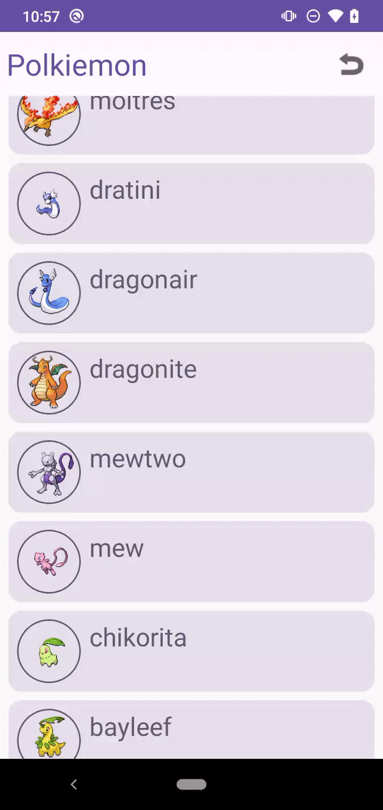

## Functionality

### Required

1. When the application starts, load and show a paginated Pokemon list, obtained from
the endpoint. (Show name and image for each Pokemon) DONE
2. When a Pokemon is selected, show a detailed view. DONE
3. Give an option to refresh the list. DONE
4. Show error info if the list cannot be loaded (eg: no network) DONE

### Bonus

1. Manage configuration changes, ideally without reloading the list. DONE
2. Add an offline mechanism so the application can work even with no network. DONE
3. Add some animations (fade in/fade out animations, etc) DONE
4. Add an option to search for a Pokemon by name.

### Thoughts

- Search is not implemented
- I have not done landscape designs, you get less details in landscape.
- There are some unhandled edge cases at the very end of the full list of Pokemon
- There is no modularisation at this point, but creating a modular architecture would help separate concerns and have more people working in parallel

Some good starting places for the app are here:
- https://github.com/blundell/polkiemon/tree/main/app/src/main/java/com/blundell/polkiemon
- https://github.com/blundell/polkiemon/blob/main/app/src/main/java/com/blundell/polkiemon/ui/list/ListPokemonScreen.kt
- https://github.com/blundell/polkiemon/blob/main/app/src/main/java/com/blundell/polkiemon/details/PokemonDetailsViewModel.kt

Here is the app in action

| List | Details | Offline |
| --- | --- | --- |
||||
